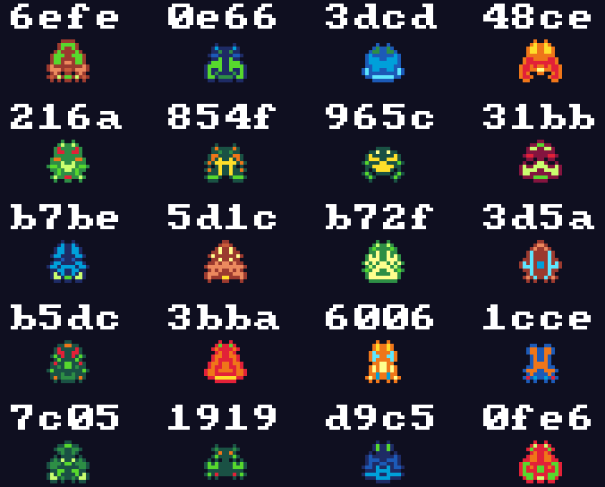
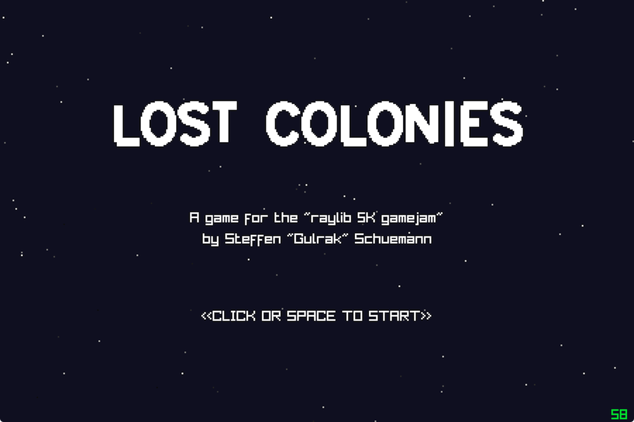
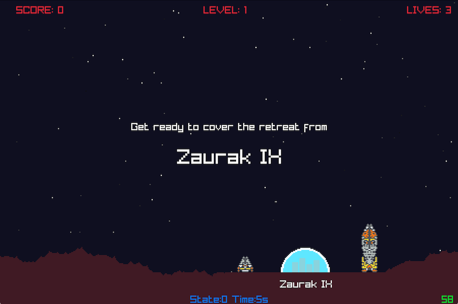
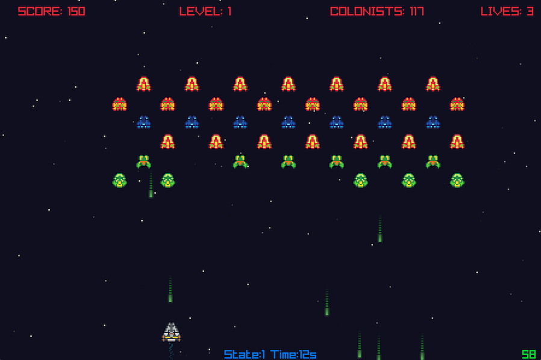

# Lost Colonies

An entry game for the [raylib 5k gamejam](https://itch.io/jam/raylib-5k-gamejam) written
in 8 days (2022-01-21T19:00Z to 2022-01-29T19:00Z) on using C++ on top of Raylib.

## The Story

> _In the year 2374 humanity has reached for the start and colonized many worlds.
> They believed to be alone in the universe but that year proved them wrong!_
>
> _It was the year humanity crossed path with the alien group they named Cicadas,
> as science revealed they where dormant for a few thousand years but reappeared
> and claimed their area of space back._
>
> _Humanity fought hard, but failed, so they decided to evacuate those colonies
> and you are chosen to protect their retreat..._

## Controls

Currently the game only supports keyboard control:

* `SPACE` - fire your weapon
* `LEFT` or `A` - move to the left
* `RIGHT` or `D` - move to the right
* `M` - mute or unmute audio
* `P` - pause the game

## Technical Details

First of all, the code is a mess, this is a gamejam project written in 8 days
using only One weekend and the evenings of six normal work days. The closer
the deadline, the dirtier the hacks. But that was to be expected.

_Lost Colonies_  was developed on macOS and tested as native application and
compiled via emscripten on a few browsers. I see no reason it would not work
on as native game on Windows and Linux too, but I didn't test during the gamejam
crunch time.

### Compiling from Source

Lost Colonies uses CMake as a build solution. To build it, checkout or download
the source.

#### Linux / macOS

Open a terminal, enter the directory where the code was extracted and run:

```
cmake -S . -B build
```

to configure the project, and

```
cmake --build build
```

to compile it.

#### Build for Web

```
cmake -S . -B build -DCMAKE_TOOLCHAIN_FILE=<path-to-emsdk>/emsdk/upstream/emscripten/cmake/Modules/Platform/Emscripten.cmake
cmake --build build
```

### Used Resources

* [raylib](https://www.raylib.com) - the fun game programming library that inspired me to write this.
* [rFXGen](https://raylibtech.itch.io/rfxgen) - A sound effects generation tool, modified a bit for this event
* [raygui](https://github.com/raysan5/raygui) - A raylib companion library for ui widgets, used in generator tooling
* [dm_property_list.h](https://github.com/raysan5/raygui/tree/master/examples/property_list) - A helper header from the `raygui` examples, modified for some visual changes and issues compiling in under C++

### Generated Sounds

From the start on I decided to try and generate my assets procedurally, I
found [Raylib](https://www.raylib.com) last year and wanted to do something with
it, and I liked the [rFXGen](https://raylibtech.itch.io/rfxgen) tool that is a
descendant of [sfxr](http://www.drpetter.se/project_sfxr.html).

### Procedural Sprites

The sprites (aliens, the aliens bom, the players ship and the colony ship) are
all generated by an algorithm derived from the works of [Zelimir Fedoran](https://github.com/zfedoran/pixel-sprite-generator)
and [David Bollinger](http://web.archive.org/web/20080228054410/http://www.davebollinger.com/works/pixelspaceships/)
extended and modified to allow varying dimensions and produce more colorful 
pixel graphic style alien sprites.



The hex codes above those sprites are the seed values for the generator to
reproduce the alien underneath.

### PRNG
The base of pseudo random numbers is an implementation of xoroshiro128++ seeded
via splitmix64 based on public domain  code from Sebastiano Vigna (vigna@acm.org)
and David Blackman.


## The Future of this Project

I sure need to catch up a bunch of hours of sleep and some days, maybe weeks
distance to continue to work on this, but the game is missing several features
and details I wanted to add and I plan to take my time to clean up the code,
refactoring the cluttered game logic, write tests and hope to make it an actual
helpful project, not only as a game.

## Screenshots

### Title Screen


### Colony to be Evacuaded


### Fighting the aliens 


